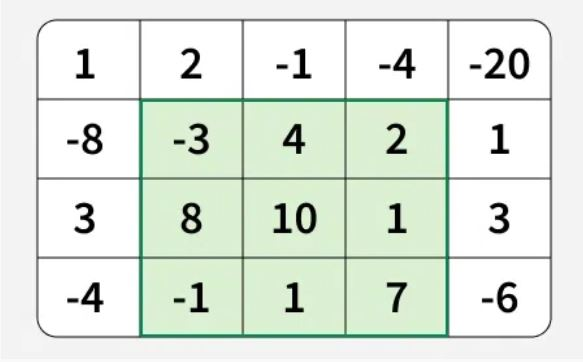

---
title: | 
  | Analyse des algorithmes de Maximum Subarray 2D
  |  M2 Data Science Algorithmique 
author:  "Taqwa Ben Romdhane, Manal Derghal, Khalil Ounis"
date: "Mercredi 9 avril 2025"
header-includes:
  - \usepackage[french]{babel}
output:
  pdf_document:
    keep_tex: yes
    toc: true
    number_sections: true  
urlcolor: blue
---

\noindent\hrulefill

# Description du problème et objectif

## Présentation du problème

Dans ce document, nous étudions le problème du sous-tableau de somme maximale du point de vue de la complexité algorithmique. Ce problème est intéressant car il existe de nombreux algorithmes pour le résoudre, dont la complexité varie considérablement.

Dans ce rapport, nous abordons uniquement deux algorithmes :

un algorithme naïf utilisant le paradigme de Brute Force,

et un algorithme optimal basé sur la méthode de Kadane.

Nous étendons ensuite le problème à deux dimensions afin de déterminer la sous-matrice contiguë de somme maximale dans une matrice. Bien que ce cas soit plus complexe, la méthode de Kadane peut également être adaptée au cas 2D.

Comme pour le cas 1D, nous proposerons deux solutions pour résoudre le problème de la sous-matrice de somme maximale.

## Objectifs :

Dans le cadre de ce projet, nous devons répondre aux objectifs suivants:

- Evaluer la performance en temps d'exécution des solutions naive et optimale

- Implémenter ces algorithmes en R et en C++ et évaluer le gain de temps

- Valider la complexité théorique attenue par une régression linéaire

# Maximum Sum Submatrix

Étant donné un tableau 2D, la tâche consiste à trouver la sous-matrice de somme maximale qu'il contient.

Imaginez que vous avez cette matrice 4x5 :

Le rectangle en vert présente la sous-matrice avec la somme maximale égale à 29.

{width="178"}

## Approche naïve

Nous explorons tous les rectangles possibles dans le tableau 2D donné, en utilisant quatre variables : deux pour définir les limites gauche et droite (`left` & `right`), et deux autres pour définir les limites supérieure et inférieure (`up` & `down`). Nous calculons leurs sommes et gardons une trace de la somme maximale trouvée.

**Complexité algorithmique** :\
$O\left((nm)^3\right)$\
Nous parcourons toutes les limites du rectangle en $O((nm)^2)$, et pour chaque rectangle, nous calculons sa somme en $O(nm)$. Par conséquent, la complexité temporelle globale est $O((nm)^3)$, où $n$ est le nombre de lignes et $m$ le nombre de colonnes de la matrice.

Pour une matrice 3×3, il y a 36 sous-matrices. Si l'on étend cela à une matrice 100×100, on obtient des millions de possibilités. Il est donc clair que la méthode naïve de force brute ne fonctionne tout simplement pas en pratique.

## Approche améliorée (Méthode de Kadane)

La nouvelle approche est basée sur l’algorithme de **Kadane**, qui est utilisé comme solution optimale dans le cas 1D.\
Nous allons expliquer comment appliquer cette méthode à un tableau 2D.\
L'idée est de **compresser la matrice 2D en une série de tableaux 1D** et de résoudre chacun d’eux à l’aide de l’algorithme de Kadane.

**Complexité algorithmique** :\
La complexité temporelle de cette approche est de $O(n \cdot m^2)$, où $n$ est le nombre de lignes et $m$ le nombre de colonnes.\
En effet, nous itérons sur toutes les paires de colonnes et, pour chaque paire, nous appliquons l’algorithme de Kadane, qui prend un temps de $O(n)$.\
La complexité spatiale est de $O(m \cdot n)$ pour le stockage des sommes de préfixes.

## Principe de l’algorithme

1.  **Fixer les limites gauche et droite :**
    -   Nous fixons les colonnes gauche (`left`) et droite (`right`) une par une.
2.  **Calculer les sommes cumulatives :**
    -   Pour chaque paire de colonnes `left` et `right`, nous calculons la somme des éléments de chaque ligne entre ces colonnes et stockons ces sommes dans un tableau auxiliaire `temp[]`.
3.  **Appliquer l’algorithme de Kadane :**
    -   En appliquant l’algorithme de Kadane sur le tableau `temp[]`, nous obtenons la somme maximale d’un sous-tableau de ce tableau, ce qui correspond à la somme maximale de la sous-matrice avec les limites de colonnes `left` et `right`.
4.  **Déterminer la sous-matrice de somme maximale :**
    -   Pour obtenir la somme maximale globale, nous prenons le maximum de toutes les sommes obtenues pour chaque paire de colonnes `left` et `right`.

### Exemple

``` r
# Input :
mat <- matrix(c(
   1, -9, -10, 1,
  -1,  10,  10, 1,
   0,   9,   9, -9,
  -1,  -1,  -1, -1
), nrow = 4, byrow = TRUE)

# Output : 38
# Explication : (top, left) = (2,2), (down, right) = (3,3)
# Sous-matrice : [[10, 10], [9, 9]]
```

# Un premier exemple

```{r, eval=FALSE}
# installer le package
devtools::install_github("AMATERASU11/MaximumSubarray")
```

```{r}
library(MaximumSubarray)
```

```{r}
n <- 4   # nombre de lignes
m <- 5   # nombre de colonnes

# Générer la matrice avec des valeurs aléatoires entre -100 et 100
set.seed(123)  
mat <- matrix(sample(-100:100, n * m, replace = TRUE), nrow = n, ncol = m)
```

```{r test}
mat
max_subarray_rectangle_naive(mat)
max_subarray_rectangle_naive_Rcpp(mat)
max_subarray_rectangle_opt(mat)
max_subarray_rectangle_opt_Rcpp(mat)
```

------------------------------------------------------------------------

# Comparaison R avec C++

On va faire des comparaisons pour les deux types d'algorithme en R et C++ pour quantifier leur différence de performance.

La fonction `one.simu.time` retourne le temps recherché, et `one.simu` sera utilisé par `microbenchmark`, on retourne le temps en ms

sur une matrice de taille 30x50, on obtient les résultats suivants :

```{r}
library(microbenchmark)

# Simulation d'un test de performance sur une matrice aléatoire de taille n x m
one.simu.time_2D <- function(n, m, func) {
  
  mat <- matrix(sample(-100:100, n * m, replace = TRUE), nrow = n, ncol = m)

  if (func == "Naive2D") {
    t <- microbenchmark(max_subarray_rectangle_naive(mat), times = 1)$time / 1e6
  } else if (func == "Kadane2D") {
    t <- microbenchmark(max_subarray_rectangle_opt(mat), times = 1)$time / 1e6
  } else if (func == "Naive2D_cpp") {
    t <- microbenchmark(max_subarray_rectangle_naive_Rcpp(mat), times = 1)$time / 1e6
  } else if (func == "Kadane2D_cpp") {
    t <- microbenchmark(max_subarray_rectangle_opt_Rcpp(mat), times = 1)$time / 1e6
  } else {
    stop("fonction inconnue")
  }

  # Arrondi à 2 décimales
  return(round(t, 2))
}

```

## Un essai

### Temps d'exécution en R

Sur un exemple, on obtient :

```{r}
# Simulation sur une matrice de taille n*m
n <- 30
m <- 50

# Exécuter la simulation
res_naive <- one.simu.time_2D(n,m,"Naive2D")
res_kadane <- one.simu.time_2D(n,m,"Kadane2D")

# Afficher les résultats
cat("time_naive:", res_naive,"ms\n")
cat("time_kadane:", res_kadane, "ms")
```

### Temps d'exécution en C++

sur une matrice de taille 30x50, on obtient les résultats suivants :

```{r}
# Simulation sur une matrice de taille n*m
n <- 30
m <- 50

res_naive_cpp <- one.simu.time_2D(n,m,"Naive2D_cpp")
res_Kadane_cpp <- one.simu.time_2D(n,m,"Kadane2D_cpp")

# Afficher les résultats
cat("time_naive_cpp:" ,res_naive_cpp,"ms\n")
cat("time_kadane_cpp:",res_Kadane_cpp, "ms")
```

## Simulations avec répétitions

On reproduit ces comparaisons de manière plus robuste: Nous calculons le gain de temps à partir de 10 répétitions de simulation

```{r}
# Simulation sur une matrice de taille n*m
n <- 30
m <- 50

nbSimus <- 10

time_naive <- rep(0, nbSimus); time_naive_cpp <- rep(0, nbSimus);
time_kadane <- rep(0, nbSimus); time_kadane_cpp <- rep(0, nbSimus)

for(i in 1:nbSimus){time_naive[i] <- one.simu.time_2D(n,m, func = "Naive2D")}
for(i in 1:nbSimus){time_naive_cpp[i] <- one.simu.time_2D(n,m, func = "Naive2D_cpp")}
for(i in 1:nbSimus){time_kadane[i] <- one.simu.time_2D(n,m, func = "Kadane2D")}
for(i in 1:nbSimus){time_kadane_cpp[i] <- one.simu.time_2D(n,m, func = "Kadane2D_cpp")}
```

### Gain R versus C++

```{r}
naive_speedup_cpp <- mean(time_naive) / mean(time_naive_cpp)
kadane_speedup_cpp <- mean(time_kadane) / mean(time_kadane_cpp)
cat("le gain R vs cpp pour naif:", round(naive_speedup_cpp,2),"ms\n")
cat("le gain R vs cpp pour Kadane:", round(kadane_speedup_cpp,2),"ms")
```

### Gain Naif Versus Kadane en R et C++

```{r}
kadane_vs_naive_R <- mean(time_naive) / mean(time_kadane)
kadane_vs_naive_Rcpp <- mean(time_naive_cpp) / mean(time_kadane_cpp)
cat("le gain naif vs Kadane en R est:",round(kadane_vs_naive_R,2), "ms\n")
cat("le gain cpp est:",round(kadane_vs_naive_Rcpp,2), "ms")
```

On recommence avec `n = 80` et `m = 60` seulement pour le gain avec C++ pour Kadane

```{r second simu}
n <- 80
m<-60

nbSimus <- 10

time_kadane <- rep(0, nbSimus); time_kadane_cpp <- rep(0, nbSimus)
for(i in 1:nbSimus){time_kadane[i] <- one.simu.time_2D(n,m, func = "Kadane2D")}
for(i in 1:nbSimus){time_kadane_cpp[i] <- one.simu.time_2D(n,m, func = "Kadane2D_cpp")}
median_kadane_R_vs_Rcpp <- median(time_kadane) / median(time_kadane_cpp)
cat("le gain Kadane en R vs Kadane en C++ est:",round(median_kadane_R_vs_Rcpp,2), "ms")
```

**Conclusion:**

### Performances C++ vs R :

-   Naïf : C++ `r round(naive_speedup_cpp)`× plus rapide\
-   Kadane : C++ `r round(kadane_speedup_cpp)`× plus rapide → `r round(median_kadane_R_vs_Rcpp)`× pour `(n,m)=(80,60)`

### Efficacité algorithmique :

-   Kadane `r round(kadane_vs_naive_R)`× mieux que naïf en R\

-   Kadane `r round(kadane_vs_naive_Rcpp)`× mieux que naïf en C++

## Simulations avec `microbenchmark`

Vous avez besoin des packages `microbenchmark` et `ggplot2` pour exécuter les simulations et afficher les résultats (sous forme de diagrammes en violon). Nous comparons `naive_Rcpp` avec `opt_Rcpp` pour des tailles de données `(n,m) = (10,5)`, `(n,m) = (20,10)` et `(n,m) = (30,40)`

```{r benchmark, echo = FALSE, warning=FALSE, message=FALSE}
library(microbenchmark)
library(ggplot2)
library(dplyr)

# Définir la fonction de benchmark
benchmark_2d <- function(n, m) {
  mat <- matrix(sample(-100:100, n * m, replace = TRUE), nrow = n, ncol = m)
  microbenchmark(
    naif2D_Cpp = max_subarray_rectangle_naive_Rcpp(mat),
    kadane2D_Cpp = max_subarray_rectangle_opt_Rcpp(mat),
    times = 50
  )
}

# Définir les tailles de matrices à tester
sizes <- list(c(10, 5), c(20, 10), c(30, 40))

# Stocker les résultats
results_2d <- list()

# Exécuter les simulations pour chaque taille de matrice
for (size in sizes) {
  n <- size[1]
  m <- size[2]
  mat <- matrix(sample(-100:100, n * m, replace = TRUE), nrow = n, ncol = m)
  res <- microbenchmark(
    naif2D_Cpp = max_subarray_rectangle_naive_Rcpp(mat),
    kadane2D_Cpp = max_subarray_rectangle_opt_Rcpp(mat),
    times = 50
  )
  
  # Ajouter les résultats au data frame
  res_df <- as.data.frame(res)
  res_df$MatrixSize <- paste(n, "x", m)
  results_2d <- append(results_2d, list(res_df))
}

# Convertir la liste en dataframe
df_2d <- do.call(rbind, results_2d)

# Visualisation
ggplot(df_2d, aes(x = expr, y = time / 1e6, fill = expr)) +
  scale_y_log10() +
  geom_violin() +
  facet_wrap(~ MatrixSize, scales = "free") +
  labs(title = "Comparaison des algorithmes Maximum Subarray 2D",
       x = "Algorithme",
       y = "Temps d'exécution (ms)") +
  theme_minimal()+
  theme(axis.text.x = element_text(angle = 60, vjust = 1, hjust = 1))
```

```{r, echo = FALSE, warning=FALSE, message=FALSE}
# Extraire les dimensions de la matrice et les ajouter en tant que colonnes séparées
resultsCpp <- df_2d %>%
  mutate(n = as.numeric(sub("x.*", "", MatrixSize)),
         m = as.numeric(sub(".*x", "", MatrixSize)),
         size = n * m)

# Créer un résumé avec les statistiques souhaitées
summary_results <- resultsCpp %>%
  group_by(size, expr) %>%
  summarise(
    min_time = min(time) / 1e6,   # Convertir les nanosecondes en millisecondes
    q1_time = quantile(time, 0.25) / 1e6,
    median_time = median(time) / 1e6,
    mean_time = mean(time) / 1e6,
    q3_time = quantile(time, 0.75) / 1e6,
    max_time = max(time) / 1e6,
    .groups = "drop"
  )

# Afficher le résumé
print(summary_results)
```

------------------------------------------------------------------------

# Evaluation de la complexité

##### Complexité expériementale (naif)

D'après la littérature, et comme expliquée précedemment, l'agorithme naif a une complexité polynomiale en O((nm)\^3), içi nous essayons d'exp

```{r simu complexite, echo = FALSE, warning=FALSE, message=FALSE}
set.seed(123)

# Fonction de benchmark pour 2D
benchmark_subarray_2d <- function(func_name, sizes, nbRep) {
  results <- lapply(sizes, function(size) {
    n <- size[1]
    m <- size[2]
    times <- replicate(nbRep, one.simu.time_2D(n, m, func_name))  # Exécuter les simulations
    data.frame(n = n, m = m, 
               mean_time = mean(times), 
               sd_time = sd(times),
               total_size = n * m)  # Taille totale de la matrice
  })
  
  do.call(rbind, results)  # Combiner les résultats en un seul data frame
}

# Paramètres
nbSimus <- 20
nbRep <- 10

# Définir les tailles des matrices pour le benchmark (carrés)
sizes_naive <- lapply(round(exp(seq(log(10), log(70), length.out = nbSimus))), function(x) c(x, x))
sizes_kadane <- lapply(round(exp(seq(log(100), log(700), length.out = nbSimus))), function(x) c(x, x))

# Benchmark pour l'algorithme naïf 2D
res_Naive_2D <- benchmark_subarray_2d("Naive2D_cpp", sizes_naive, nbRep)

# Benchmark pour Kadane 2D
res_Kadane_2D <- benchmark_subarray_2d("Kadane2D_cpp", sizes_kadane, nbRep)

# Graphique log-log avec barres d'erreur
ggplot() +
  # Algorithme naïf 2D
  geom_line(data = res_Naive_2D, aes(x = total_size, y = mean_time, color = "Naïf Rcpp"), size = 1) +
  geom_errorbar(data = res_Naive_2D, aes(x = total_size, ymin = mean_time - sd_time, ymax = mean_time + sd_time), width = 0.1, alpha = 0.5) +
  
  # Algorithme de Kadane 2D
  geom_line(data = res_Kadane_2D, aes(x = total_size, y = mean_time, color = "Kadane Rcpp"), size = 1) +
  geom_errorbar(data = res_Kadane_2D, aes(x = total_size, ymin = mean_time - sd_time, ymax = mean_time + sd_time), width = 0.1, alpha = 0.5) +
  
  # Échelles logarithmiques
  scale_x_log10() +
  scale_y_log10() +
  
  # Labels & thème
  labs(title = "Performance des algorithmes Maximum Subarray 2D",
       x = "Taille totale de la matrice (n×n)",
       y = "Temps moyen d'exécution (ms)",
       color = "Algorithme") +
  theme_minimal() +
  theme(legend.position = "bottom")


```

```{r}
# Affichage des résultats
cat("Les résultats pour la solution naïve:")
res_Naive_2D
cat("Les résultats pour la solution optimale:")
res_Kadane_2D
```

On vérifie la valeur du coefficient directeur pour les deux méthodes:

```{r, echo = FALSE, warning=FALSE, message=FALSE}
# Estimation de la complexité pour l'algorithme naïf
model_naive_2D <- lm(log(res_Naive_2D$mean_time) ~ log(res_Naive_2D$n))
print(summary(model_naive_2D)) 
cat("Exposant estimé (naïf):", coef(model_naive_2D)[2])
```

```{r, echo = FALSE, warning=FALSE, message=FALSE}
# Estimation de la complexité pour Kadane
model_kadane_2D <- lm(log(res_Kadane_2D$mean_time) ~ log(res_Kadane_2D$n))
print(summary(model_kadane_2D)) 
cat("Exposant estimé (Kadane):", coef(model_kadane_2D)[2])
```

Les coefficients directeurs trouvés sont bien ceux que l'on attendait. La valeur pour la méthode naïve 6 car $O\left((nm)^3\right)$ = $O\left((n^2)^3\right)$ et 3 car $O(n \cdot m^2)$ = $O(n \cdot n^2)$ pour l'algorithme de Kadane

------------------------------------------------------------------------

# Cas particulier des données presques triées

On considère des données triées avec 5% de valeurs échangées au hasard.

Sur un exemple cela donne :

```{r}
# Création d'une matrice triée
n <- 10  # nombre de lignes
m <- 10  # nombre de colonnes
v <- 1:(n * m)
n_swap <- floor(0.05 * length(v))
swap_indices <- sample(length(v), n_swap)
v[swap_indices] <- sample(v[swap_indices])
mat <- matrix(v, nrow = n, ncol = m)
mat
```

```{r}

# Fonctions de simulation
one.simu <- function(n,m, func) {
  mat <- matrix(sample(-100:100, n * m, replace = TRUE), nrow = n, ncol = m)
  if (func == "Naive2D_cpp") return(max_subarray_rectangle_naive(mat))
  if (func == "Kadane2D_cpp") return(max_subarray_rectangle_opt_Rcpp(mat))
}

one.simu2 <- function(n,m, func) {
  v <- 1:(n * m)
  n_swap <- floor(0.05 * length(v))
  swap_indices <- sample(length(v), n_swap)
  v[swap_indices] <- sample(v[swap_indices])
  mat <- matrix(v, nrow = n, ncol = m)
  if (func == "Naive2D_cpp") return(max_subarray_rectangle_naive(mat))
  if (func == "Kadane2D_cpp") return(max_subarray_rectangle_opt_Rcpp(mat))
}
```

```{r benchmark2, echo = FALSE, warning=FALSE, message=FALSE}
# Définir la fonction de benchmark
benchmark_subarray_2d <- function(n, m,times=50) {
  microbenchmark(
    naive_random_2D = one.simu(n,m, "Naive2D_cpp"),
    kadane_random_2D = one.simu(n,m, "Kadane2D_cpp"),
    naive_sorted_2D = one.simu2(n,m, "Naive2D_cpp"),
    kadane_sorted_2D = one.simu2(n,m, "Kadane2D_cpp"),
    times = times
  )
}

# Définir les tailles de matrices à tester
sizes <- list(c(10, 5), c(30, 40))

# Stocker les résultats
results_2d <- list()

# Exécution des benchmarks
for (size in sizes) {
  n <- size[1]
  m <- size[2]
  res <- benchmark_subarray_2d(n, m, times = 50)
  res_df <- as.data.frame(res)
  res_df$MatrixSize <- paste(n, "x", m)
  results_2d <- append(results_2d, list(res_df))
}

# Fusion des résultats
df_2d <- do.call(rbind, results_2d)

# Visualisation
ggplot(df_2d, aes(x = expr, y = time / 1e6, fill = expr)) +
  scale_y_log10() +
  geom_violin(alpha = 0.7) +
  facet_wrap(~ MatrixSize, scales = "free") +
  labs(title = "Comparaison des algorithmes Maximum Subarray 2D",
       x = "Algorithme",
       y = "Temps d'exécution (ms)") +
  theme_minimal()+
  theme(axis.text.x = element_text(angle = 60, vjust = 1, hjust = 1))
```

```{r, echo = FALSE, warning=FALSE, message=FALSE}
# Extraire les dimensions de la matrice et les ajouter en tant que colonnes séparées
resultsCpp <- df_2d %>%
  mutate(n = as.numeric(sub("x.*", "", MatrixSize)),
         m = as.numeric(sub(".*x", "", MatrixSize)),
         size = n * m)

# Créer un résumé avec les statistiques souhaitées
summary_results <- resultsCpp %>%
  group_by(size, expr) %>%
  summarise(
    min_time = min(time) / 1e6,   # Convertir les nanosecondes en millisecondes
    q1_time = quantile(time, 0.25) / 1e6,
    median_time = median(time) / 1e6,
    mean_time = mean(time) / 1e6,
    q3_time = quantile(time, 0.75) / 1e6,
    max_time = max(time) / 1e6,
    .groups = "drop"
  )

# Afficher le résumé
print(summary_results)
```

Pour `(n,m) = (10,5)`, le temps d'exécution est plus rapide que pour `(n,m) = (30,40)`. Kadane est toujours plus rapide que Naïf, avec un écart plus important à `(n,m) = (30,40)`. Lorsque les tableaux sont triés, Naïf et Kadane sont beaucoup plus rapides, avec un écart réduit entre les deux.


# Cas particulier avec matrice symétrique

On considère une matrice symétrique

Sur un exemple cela donne : 

```{r}
# Création d'une matrice triée
n <- 10  # nombre de lignes
m <- 10  # nombre de colonnes

v_sym <- sample(1:100, n * m, replace = TRUE)
mat <- matrix(v_sym, nrow = n, ncol = m)
mat[lower.tri(mat)] <- t(mat)[lower.tri(mat)]
  
mat
```

```{r}
# Fonctions de simulation
one.simu <- function(n,m, func) {
  mat <- matrix(sample(-100:100, n * m, replace = TRUE), nrow = n, ncol = m)
  if (func == "Naive2D_cpp") return(max_subarray_rectangle_naive(mat))
  if (func == "Kadane2D_cpp") return(max_subarray_rectangle_opt_Rcpp(mat))
}

one.simu2 <- function(n,m, func) {
  v_sym <- sample(1:100, n * m, replace = TRUE)
  mat <- matrix(v_sym, nrow = n, ncol = m)
  mat[lower.tri(mat)] <- t(mat)[lower.tri(mat)]
  if (func == "Naive2D_cpp") return(max_subarray_rectangle_naive(mat))
  if (func == "Kadane2D_cpp") return(max_subarray_rectangle_opt_Rcpp(mat))
}
```

```{r benchmark3, echo = FALSE, warning=FALSE, message=FALSE}
# Définir la fonction de benchmark
benchmark_subarray_2d <- function(n, m,times=50) {
  microbenchmark(
    naive_random_2D = one.simu(n,m, "Naive2D_cpp"),
    kadane_random_2D = one.simu(n,m, "Kadane2D_cpp"),
    naive_sym_2D = one.simu2(n,m, "Naive2D_cpp"),
    kadane_sym_2D = one.simu2(n,m, "Kadane2D_cpp"),
    times = times
  )
}

# Définir les tailles de matrices à tester
sizes <- list(c(10, 10), c(40, 40))

# Stocker les résultats
results_2d <- list()

# Exécution des benchmarks
for (size in sizes) {
  n <- size[1]
  m <- size[2]
  res <- benchmark_subarray_2d(n, m, times = 50)
  res_df <- as.data.frame(res)
  res_df$MatrixSize <- paste(n, "x", m)
  results_2d <- append(results_2d, list(res_df))
}

# Fusion des résultats
df_2d <- do.call(rbind, results_2d)

# Visualisation
ggplot(df_2d, aes(x = expr, y = time / 1e6, fill = expr)) +
  scale_y_log10() +
  geom_violin(alpha = 0.7) +
  facet_wrap(~ MatrixSize, scales = "free") +
  labs(title = "Comparaison des algorithmes Maximum Subarray 2D",
       x = "Algorithme",
       y = "Temps d'exécution (ms)") +
  theme_minimal()+
  theme(axis.text.x = element_text(angle = 60, vjust = 1, hjust = 1))
```

```{r, echo = FALSE, warning=FALSE, message=FALSE}
# Extraire les dimensions de la matrice et les ajouter en tant que colonnes séparées
resultsCpp <- df_2d %>%
  mutate(n = as.numeric(sub("x.*", "", MatrixSize)),
         m = as.numeric(sub(".*x", "", MatrixSize)),
         size = n * m)

# Créer un résumé avec les statistiques souhaitées
summary_results <- resultsCpp %>%
  group_by(size, expr) %>%
  summarise(
    min_time = min(time) / 1e6,   # Convertir les nanosecondes en millisecondes
    q1_time = quantile(time, 0.25) / 1e6,
    median_time = median(time) / 1e6,
    mean_time = mean(time) / 1e6,
    q3_time = quantile(time, 0.75) / 1e6,
    max_time = max(time) / 1e6,
    .groups = "drop"
  )

# Afficher le résumé
print(summary_results)
```

Pour `(n,m) = (10,10)`, le temps d'exécution est plus rapide que pour `(n,m) = (40,40)`. Kadane est toujours plus rapide que Naïf, avec un écart plus important à `(n,m) = (40,40)`. Lorsque les tableaux sont symétriques, Naïf et Kadane sont beaucoup plus rapides, avec un écart réduit entre les deux.
