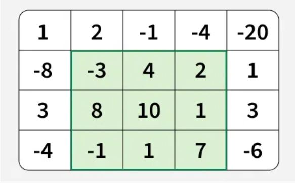

```{r setup, include=FALSE}
knitr::opts_chunk$set(echo = TRUE)
```

1.  **Introduction**

    -   Présentation du problème

    -   Objectifs

2.  **Max subarray sum**

    -   Solution naïve (Méthode Brut Force)

    -   Solution optimale (algorithme de Kadane)

3.  **Max sum submatrix**

    -   Solution naïve

    -   Solution optimale (algorithme de Kadane)

4.  **Évaluation des performances**

    -   Temps d'exécution pour le problème 1D

    -   Temps d'exécution pour le problème 2D

5.  **Analyse de la complexité**

    -   Complexité théorique pour le problème 1D

    -   Complexité théorique pour le problème 2D

6.  **Discussion**

7.  **Références**

## 

### **Maximum Sum Submatrix**

Etant donné un tableau 2D, la tâche consiste à trouver la sous-matrice de somme maximale qu'il contient.

Imaginez que vous avez cette matrice 4x5 :

Le rectangle en vert présente la sous-matrice avec la somme maximale égale à 29.

{width="279"}

#### Approche naïve :

Nous explorons tous les rectangles possibles dans le tableau 2D donné, en utilisant quatre variables : deux pour définir les limites gauche et droite et deux autres pour définir les limites supérieure et inférieure et calculer leurs sommes, et garder une trace de la somme maximale trouvée.

**Complexité algorithmique** : $O\left((n m)^3\right)$ *car nous parcourons toutes les limites du rectangle en* $O\left((n m)^2\right)$. Pour chaque rectangle, nous calculons sa somme en $O\left((n m)\right)$*. Par conséquent, la complexité temporelle globale est* $O\left((n m)^3\right)$, $O\left((n m)^2\cdot nm\right)$ *=* $O((nm) ^ 3)$ . où n est le nombre de lignes et m le nombre de colonnes de la matrice.

Pour une matrice 3×3, il y a 36 sous-matrices. Si l'on étend cela à une matrice 100×100, on obtient des millions de possibilités. et donc il est clair que la méthode naive de force brute ne fonctionne tout simplement pas en pratique.

**Approche améliorée Kadane's Method :**

la nouvelle approche est basé sur l'algorithme Kadane qui a été utilisé comme solution optimale dans le problème 1D, Dans ce qui suit, nous allons expliquer comment appliquer cette méthode sur un tableau 2D, l'idée est de compresser la matrice 2D en une série de tableaux 1D et résoudre chacun d'eux à l'aide de l'algorithme de Kadane.

##### **Principe de l'algorithme**

1.  **Fixer les limites gauche et droite** :

    -   Nous fixons les colonnes gauche (leftleft) et droite (rightright) une par une.

2.  **Calculer les sommes cumulatives** :

    -   Pour chaque paire de colonnes leftleft et rightright, nous calculons la somme des éléments de chaque ligne entre ces colonnes et stockons ces sommes dans un tableau auxiliaire `temp[]`.

3.  **Appliquer l'algorithme de Kadane** :

    -   En appliquant l'algorithme de Kadane sur le tableau `temp[]`, nous obtenons la somme maximale d'un sous-tableau de ce tableau, ce qui correspond à la somme maximale de la sous-matrice avec les limites de colonnes leftleft et rightright.

4.  **Déterminer la sous-matrice de somme maximale** :

    -   Pour obtenir la somme maximale globale, nous prenons le maximum de toutes les sommes obtenues pour chaque paire de colonnes leftleft et rightright.

        **Output 1:**\
        (top, left) : (1, 1)\
        (bottom, right) : (3, 3)\
        29

#### Un premier test

```{r}
# installer le package
devtools::install_github("AMATERASU11/MaximumSubarray")

# charger le package
library(MaximumSubarray)
```

```{r}
# Définir la matrice
mat1 <- matrix(c(
  1, 2, -1, -4, -20,
  -8, -3, 4, 2, 1,
  3, 8, 10, 1, 3,
  -4, -1, 1, 7, -6
), nrow = 4, byrow = TRUE)

mat_list <- lapply(1:nrow(mat1), function(i) matrix[i, ])

# Afficher la matrice
print(matrix)
print(mat_list)
```

```{r}
max_subarray_rectangle_naive(matrix)
max_subarray_rectangle_naive_Rcpp(mat_list)
max_subarray_rectangle_opt(matrix)
max_subarray_rectangle_opt_Rcpp(mat_list)
```

##### Temps d'exécution en R

```{r}
library(microbenchmark)

# a et b sont les bornes inf et sup de la matrice
one.simu.time <- function(n, m, func) {
  
  # définir la matrice
  matrix <- matrix(sample(-20:20, n * m, replace = TRUE), nrow = n, ncol = m)
  mat_list <- lapply(1:nrow(matrix), function(i) matrix[i, ])
  
  if (func == "naive2D") {
    t <- microbenchmark(max_subarray_rectangle_naive(matrix), times=1)$time/1e6}
  if (func == "Kadane2D") {
    t <- microbenchmark(max_subarray_rectangle_opt(matrix), times=1)$time/1e6}
  if (func == "Naive2D_Rcpp") {
    t <- microbenchmark(max_subarray_rectangle_naive_Rcpp(mat_list), times=1)$time/1e6}
  if(func == "Kadane2D_Rcpp") {
    t <- microbenchmark(max_subarray_rectangle_opt_Rcpp(mat_list), times=1)$tim/1e6}
  
  # Arrondi à 2 décimales
  t <- round(t,2)
  return(t)
}
```

```{r}
set.seed(23)
# Simulation sur une matrice de taille n*m
n <- 30
m <- 50

# Exécuter la simulation
res_naive <- one.simu.time(n,m,"naive2D")
res_kadane <- one.simu.time(n,m,"Kadane2D")

# Afficher les résultats
cat("time_naive:", res_naive,"ms\n")
cat("time_kadane:", res_kadane, "ms")
```

##### Temps d'exécution en C++

```{r}

set.seed(23)

# Simulation sur une matrice de taille n*m
n <- 30
m <- 50

res_naive_Rcpp <- one.simu.time(n,m,"Naive2D_Rcpp")
res_Kadane_Rcpp <- one.simu.time(n,m,"Kadane2D_Rcpp")

# Afficher les résultats
cat("time_naive_Rcpp:" ,res_naive_Rcpp,"ms\n")
cat("time_kadane_Rcpp:",res_Kadane_Rcpp, "ms")
```

##### Gain Naif versus Kadane en R

```{r}

# Nombre de simulations
nbSimus <- 10

# Vecteurs pour stocker les temps d'exécution
time_naive <- rep(0, nbSimus)
time_opt <- rep(0, nbSimus)

# Taille de la matrice
rows <- 30
cols <- 50
set.seed(23)

# Mesurer le temps d'exécution pour l'algorithme naïf
for (i in 1:nbSimus) {
  time_naive[i] <- one.simu.time(rows,cols,func="naive2D")}

# Mesurer le temps d'exécution pour l'algorithme optimal
for (i in 1:nbSimus) {
  time_opt[i] <- one.simu.time(rows,cols,func="Kadane2D")}

# Calculer les gains de performance
gain <- mean(time_opt)/mean(time_naive)
print(round(gain,4))
```

##### Gain Naif Versus Kadane en C++

```{r}
# Nombre de simulations
nbSimus <- 10

# Vecteurs pour stocker les temps d'exécution
time_naive <- rep(0, nbSimus)
time_opt <- rep(0, nbSimus)

# Taille de la matrice
rows <- 30
cols <- 50
set.seed(23)

# Mesurer le temps d'exécution pour l'algorithme naïf
for (i in 1:nbSimus) {
  time_naive[i] <- one.simu.Rcpp(rows, cols, "Naive2D_Rcpp")
}

# Mesurer le temps d'exécution pour l'algorithme optimal
for (i in 1:nbSimus) {
  time_opt[i] <- one.simu.Rcpp(rows, cols, "Kadane2D_Rcpp")
}

# Calculer les gains de performance
gainRcpp <- mean(time_naive)/mean(time_opt)
print(gainRcpp)
```

#### Gain R versus C++

```{r}

# Nombre de simulations
nbSimus <- 10

# Vecteurs pour stocker les temps d'exécution
time_naive <- rep(0, nbSimus)
time_opt <- rep(0, nbSimus)
time_naive_Rcpp <- rep(0, nbSimus)
time_opt_Rcpp <- rep(0, nbSimus)

# Taille de la matrice
rows <- 30
cols <- 50
set.seed(23)

# Mesurer le temps d'exécution pour l'algorithme naïf
for (i in 1:nbSimus) {
  time_naive[i] <- one.simu.time(rows, cols, "naive2D")
}

for (i in 1:nbSimus) {
  time_naive_Rcpp[i] <- one.simu.time(rows, cols, "Naive2D_Rcpp")
}

# Mesurer le temps d'exécution pour l'algorithme optimal
for (i in 1:nbSimus) {
  time_opt[i] <- one.simu.time(rows, cols, "Kadane2D")}

# Mesurer le temps d'exécution pour l'algorithme optimal
for (i in 1:nbSimus) {
  time_opt_Rcpp[i] <- one.simu.time(rows, cols, "Kadane2D_Rcpp")
}

# Calculer les gains de performance
gain1 <- mean(time_naive)/mean(time_naive_Rcpp)
gain2 <- mean(time_opt)/mean(time_opt_Rcpp)
cat("le gain R vs C++ pour naif est:", gain1, "ms\n")
cat("le gain R vs C++ pour Kadane est:", gain2,"ms")
```

#### Simulation avec microbenchmark

```{r}
library(microbenchmark)
library(ggplot2)
```

```{r}
# n est le nombre de lignes
# m est le nombre de colonnes

simu <- function(n, m, func) {
  matrix <- matrix(sample(-20:20, n * m, replace = TRUE), nrow = n, ncol = m)
  mat_list <- lapply(1:nrow(matrix), function(i) matrix[i, ])
  
  if (func == "naive2D") {
    t <- system.time(max_subarray_rectangle_naive(matrix))[[1]]
  }
  if (func == "kadane2D") {
    t <- system.time(max_subarray_rectangle_opt(matrix))[[1]]
  }
  if (func == "naive2D_Rcpp") {
    t <- system.time(max_subarray_rectangle_naive_Rcpp(mat_list))[[1]]
  }
  if (func == "kadane2D_Rcpp") {
    t <- system.time(max_subarray_rectangle_opt_Rcpp(mat_list))[[1]]
  }
  return(t)
}
```

```{r}

simu.time <- function(n, m, func) {
  matrix <- matrix(sample(-20:20, n * m, replace = TRUE), nrow = n, ncol = m)
  mat_list <- lapply(1:nrow(matrix), function(i) matrix[i, ])
  
  if (func == "naive2D") {
    t <- microbenchmark(max_subarray_rectangle_naive(matrix), times=1)$time/1e6}
  if (func == "Kadane2D") {
    t <- microbenchmark(max_subarray_rectangle_opt(matrix), times=1)$time/1e6}
  if (func == "Naive2D_Rcpp") {
    t <- microbenchmark(max_subarray_rectangle_naive_Rcpp(mat_list), times=1)$time/1e6}
  if(func == "Kadane2D_Rcpp") {
    t <- microbenchmark(max_subarray_rectangle_opt_Rcpp(mat_list), times=1)$tim/1e6}
  
  # Arrondi à 2 décimales
  t <- round(t,2)
  return(as.numeric(t))
}
```

Nous comparons l'algo naive avec Kadane en version R pour des tailles de matrices différentes

```{r}
library(microbenchmark)
library(ggplot2)

# Définir les tailles de matrices à tester
sizes <- list(c(4,5), c(25, 40), c(60,60))

# Stocker les résultats
results <- list()

# Exécuter les simulations pour chaque taille de matrice
for (size in sizes) {
  n <- size[1]
  m <- size[2]
  res <- microbenchmark(
    naive = simu(n, m, "naive2D"),
    kadane = simu(n, m, "kadane2D"),
    times = 50
  )
  results[[paste(n, "x", m)]] <- res
}

# Afficher les résultats sous forme de diagrammes en violon
for (size in sizes) {
  n <- size[1]
  m <- size[2]
  print(autoplot(results[[paste(n, "x", m)]]) + ggtitle(paste("Taille de la matrice:", n, "x", m)))
}
```

```{r}
library(microbenchmark)
library(ggplot2)

# Définir les tailles de matrices à tester
sizes <- list(c(10, 5), c(20, 10))

# Stocker les résultats
results <- data.frame()
set.seed(23)

# Exécuter les simulations pour chaque taille de matrice
for (size in sizes) {
  n <- size[1]
  m <- size[2]
  res <- microbenchmark(
    naive = simu(n, m, "naive2D"),
    kadane = simu(n, m, "kadane2D"),
    times = 50
  )
  
  # Ajouter les résultats au data frame
  res_df <- as.data.frame(res)
  res_df$MatrixSize <- paste(n, "x", m)
  results <- rbind(results, res_df)
}

# Afficher les résultats sous forme de diagrammes en violon
ggplot(results, aes(x = expr, y = time / 1e6, fill = expr)) +
  geom_violin() +
  facet_wrap(~ MatrixSize, scales = "free") +
  scale_fill_manual(values = c("naive" = "#DAB3FF", "kadane" = "#FFFACD")) +
  labs(title = "Comparaison Benchmark des temps d'exécution",
       x = "Algorithme",
       y = "Temps d'exécution (ms)") +
  theme_minimal()
```

```{r}
library(microbenchmark)
library(ggplot2)

# Définir les tailles de matrices à tester
sizes <- list(c(10, 15), c(10, 15))

# Stocker les résultats
results <- data.frame()

# Exécuter les simulations pour chaque taille de matrice
for (size in sizes) {
  n <- size[1]
  m <- size[2]
  res <- microbenchmark(
    naive = simu(n, m, "naive2D_Rcpp"),
    kadane = simu(n, m, "kadane2D_Rcpp"),
    times = 50
  )
  
  # Ajouter les résultats au data frame
  res_df <- as.data.frame(res)
  res_df$MatrixSize <- paste(n, "x", m)
  results <- rbind(results, res_df)
}

# Afficher les résultats sous forme de diagrammes en violon
ggplot(results, aes(x = expr, y = time / 1e6, fill = expr)) +
  geom_violin() +
  facet_wrap(~ MatrixSize, scales = "free") +
  labs(title = "Comparaison Benchmark des temps d'exécution Rcpp",
       x = "Algorithme",y = "Temps d'exécution (ms)") +
  theme_minimal()
```

#### Analyse de la complexité

##### Complexité théorique de l'algorithme naif 

```{r}

# Nombre de simulations
nbSimus <- 5
vector_n <- list(c(10, 5), c(20, 30), c(40, 40), c(50, 50), c(60, 60))
vect_m <- list
nbRep <- 50

# Stocker les résultats
res_naive <- data.frame(matrix(0, nbSimus, nbRep + 1))
res_opt <- data.frame(matrix(0, nbSimus, nbRep + 1))
colnames(res_naive) <- c("n", paste0("Rep", 1:nbRep))
colnames(res_opt) <- c("n", paste0("Rep", 1:nbRep))

# Exécuter les simulations pour chaque taille de matrice
for (j in 1:nbSimus) {
  n <- vector_n[[j]][1]
  m <- vector_n[[j]][2]
  
  res_naive[j,] <- c(paste(n, "x", m), replicate(nbRep,one.simu.time(n, m, func = "naive2D")))
  res_opt[j,] <- c(paste(n, "x", m), replicate(nbRep, one.simu.time(n, m, func = "opt2D")))
}

# Calculer les moyennes des temps d'exécution
mean_naive <- rowMeans(res_naive[,-1])
mean_opt <- rowMeans(res_opt[,-1])

# Afficher les résultats
plot(1:nbSimus, mean_naive, type = 'b', col = 'red', xlab = "Taille de la matrice (index)", ylab = "Temps moyen en ms", main = "Comparaison des temps d'exécution")
lines(1:nbSimus, mean_opt, type = 'b', col = "blue")
legend("topright", legend = c("Naive2D", "Opt2D"), col = c("red", "blue"), lty = 1)

# Régression linéaire pour confirmer la complexité théorique
lm_naive <- lm(log(mean_naive) ~ log(sapply(vector_n, function(x) x[1] * x[2])))
lm_opt <- lm(log(mean_opt) ~ log(sapply(vector_n, function(x) x[1] * x[2])))
summary(lm_naive)
summary(lm_opt)
```

##### Complexité théorique de l'algorithme optimal

```{r}
nbSimus <- 20

vect_n <- seq(from = 5, to = 20, length.out = nbSimus)
vect_n <- round(vector_n)  
vect_m <- seq(from = 10, to = 30, length.out = nbSimus)
vect_m <- round(vect_m)

# nombre de répétitions
nbRep <- 50

# Stocker les résultats
res_naive <- data.frame(matrix(0, nbSimus, nbRep + 2))
res_opt <- data.frame(matrix(0, nbSimus, nbRep + 2))
colnames(res_naive) <- c("nrow", "ncol", paste0("Rep", 1:nbRep))
colnames(res_opt) <- c("nrow", "ncol", paste0("Rep", 1:nbRep))

# Exécuter les simulations pour chaque taille de matrice
for (j in 1:nbSimus) {
  n <- vect_n[j]
  m <- vect_m[j]
  
  res_naive[j,] <- c(n, m, replicate(nbRep, simu.time(n, m, func = "naive2D")))
  res_opt[j,] <- c(n, m, replicate(nbRep, simu.time(n, m, func = "Kadane2D")))
}

# Calculer les moyennes des temps d'exécution
mean_naive <- rowMeans(res_naive[, -c(1, 2)])
mean_opt <- rowMeans(res_opt[, -c(1, 2)])

# Afficher les résultats
plot(1:nbSimus, mean_naive, type = 'b', col = 'purple', xlab = "Taille de la matrice (index)", ylab = "Temps moyen en ms", main = "Temps d'exécution - Naive2D")


# Régression linéaire pour confirmer la complexité théorique
lm_naive <- lm(log(mean_naive) ~ log(vect_n * vect_m))
#lm_opt <- lm(log(mean_opt) ~ log(vect_n * vect_m))
summary(lm_naive)
#summary(lm_opt)
```

```{r}
# Méthode de régression plus simple moins précise
```

```{r}

```

```{r}

```
